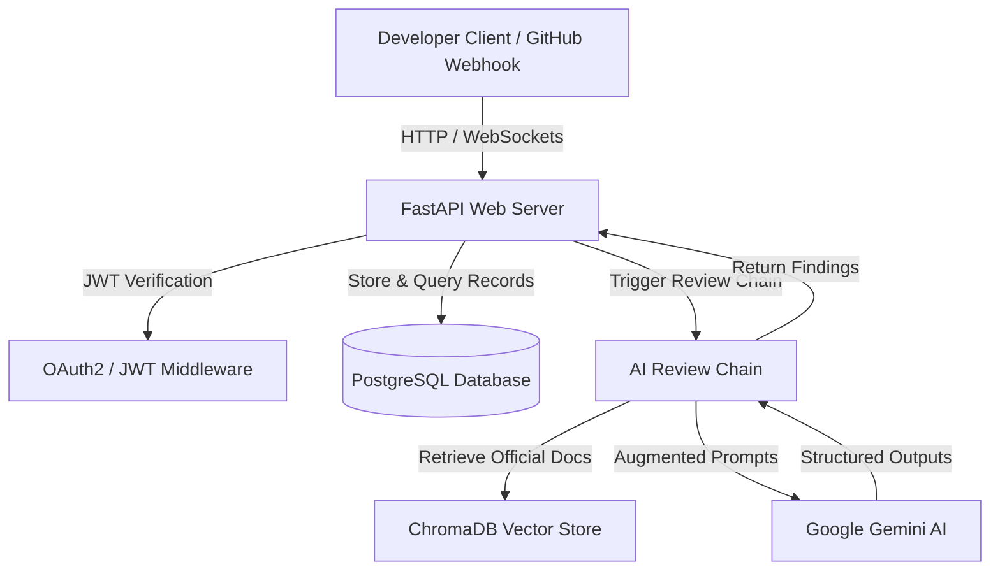

# AI Code Review & Bug Detection API

An advanced developer tool backend that automates code reviews, detects syntax/logic bugs, suggests optimization fixes, and answers questions about an uploaded codebase. Powered by **FastAPI**, **LangChain**, **ChromaDB**, **PostgreSQL**, and **Google Gemini AI**.

---

## 🌟 Demo Preview


---

## 🏗️ Architecture



---

## 🏷️ GitHub Topics
When publishing this repository, add the following topics to make it easily discoverable:
`fastapi` `langchain` `rag` `chromadb` `gemini` `websockets` `python` `code-review`

---

## 🌟 Core Features

*   **AI Code Review Engine:** Analyzes Python, JavaScript, TypeScript, SQL, and Java code snippets. Generates structured JSON reports containing bug descriptions, line numbers, severity tags (`critical`, `warning`, `info`), concrete fix suggestions, and a quality score (0–100).
*   **RAG (Retrieval-Augmented Generation) over Docs:** Indexes official language/framework documentation (e.g. Python, JS, FastAPI) in **ChromaDB**. The code review engine retrieves this context to ground its review, citing references in its results.
*   **Codebase Q&A Chat:** Upload zipped codebase projects. The system extracts and indexes files into ChromaDB, allowing you to ask structural questions (e.g., *"Where is the database connection defined?"*, *"How does the auth middleware work?"*).
*   **Real-Time Streaming WebSockets:** Streams review feedback token-by-token using FastAPI WebSockets for both code review (`/ws`) and codebase Q&A chat.
*   **GitHub Webhook Autopilot:** Register a webhook handler (`POST /webhooks/github`) to automatically receive PR events, pull changed code files, analyze them, save the reports, and post inline comments directly back on the GitHub PR.
*   **Platform-Wide Admin Analytics:** Exposes analytics dashboards (`GET /code-reviews/analytics`) restricted to admins, tracking code quality trends, bug severity frequencies, source distribution, and language metrics.

---

## 💻 Tech Stack

*   **Framework:** FastAPI (Python)
*   **Database:** PostgreSQL (with SQLAlchemy ORM)
*   **Vector Database:** ChromaDB
*   **AI/LLM Framework:** LangChain & LangChain Google GenAI (Gemini 2.5)
*   **WS Broker / Queue:** Celery & Redis (optional background workers)
*   **HTTP Client:** HTTPX
*   **Tests:** Pytest, pytest-cov, respx

---

## 🚀 Getting Started

### 1. Prerequisites
Ensure you have Python 3.10+ installed and running PostgreSQL and Redis instances.

### 2. Installation
Clone the repository, navigate to the folder, and set up your virtual environment:

```bash
# Create and activate virtual environment
python -m venv venv
.\venv\Scripts\activate      # Windows
source venv/bin/activate    # macOS/Linux

# Install dependencies
pip install -r requirements.txt
```

### 3. Environment Variables
Create a `.env` file in the project root:

```ini
DATABASE_HOSTNAME=localhost
DATABASE_PORT=5432
DATABASE_PASSWORD=your_postgres_password
DATABASE_NAME=ai_code_review
DATABASE_USERNAME=postgres
SECRET_KEY=your_jwt_secret_key_here
ALGORITHM=HS256
ACCESS_TOKEN_EXPIRE_MINUTES=30
GOOGLE_API_KEY=your_google_gemini_api_key_here
GITHUB_TOKEN=your_optional_github_pat_token_here
```

### 4. Running the Application
FastAPI automatically initializes PostgreSQL tables on startup. Run the Uvicorn server:

```bash
uvicorn app.main:app --host 127.0.0.1 --port 8000 --reload
```

Open `http://127.0.0.1:8000/docs` in your browser to view the interactive **Swagger UI** API documentation.

---

## 📁 Project Structure

```text
├── app/
│   ├── ai/
│   │   ├── chains/         # LangChain workflow chains (review, chat)
│   │   ├── prompts/        # System and user prompt templates
│   │   ├── RAG/            # ChromaDB document and codebase indexers & retrievers
│   │   └── schemas/        # AI structured schemas (ReviewOutput, BugFinding)
│   ├── core/               # Security utils, JWT config, and OAuth2 middleware
│   ├── db/                 # Database config & engine setup
│   ├── models/             # SQLAlchemy DB schemas (User, CodeReview, ChatMessage, Session)
│   ├── routers/            # FastAPI API endpoints (Auth, User, RAG, Webhooks, Reviews)
│   ├── schemas/            # Pydantic schemas for API payloads
│   ├── services/           # DB access services and business logic helpers
│   └── main.py             # FastAPI App definition and router registrations
├── tests/                  # Robust Pytest Test Suite
│   ├── conftest.py         # Shared database fixtures, auth helpers, and AI mocks
│   ├── test_auth_and_user.py
│   ├── test_code_review_router.py
│   ├── test_codebase_session.py
│   ├── test_github_webhook.py
│   ├── test_rag_retriever.py
│   └── test_review_chain.py
├── requirements.txt
└── .env
```

---

## 📡 API Reference

### Authentication & Users
*   `POST /users/` - Register a new user.
*   `POST /login` - Login with credentials (form data) to retrieve JWT access token.
*   `GET /users/` - Fetch all users (Admin only).
*   `GET /users/{id}` - Fetch single user details (Admin only).

### Code Reviews
*   `POST /code-reviews/analyze` - Analyze code snippet with AI RAG-grounded model.
*   `POST /code-reviews/` - Save a manual code review entry.
*   `GET /code-reviews/` - Fetch user's code reviews.
*   `GET /code-reviews/analytics` - Admin metrics dashboard (bug severity, quality scores, languages).
*   `WEBSOCKET /code-reviews/ws` - Establish real-time token-by-token code review streaming.

### Codebase Q&A Sessions
*   `POST /sessions/upload` - Upload and index a `.zip` codebase project (starts RAG pipeline).
*   `POST /sessions/` - Register a session manually in DB.
*   `POST /sessions/{id}/ask` - Ask a question about the indexed codebase. Use query parameter `?format=text` to return formatted text directly.
*   `WEBSOCKET /sessions/{id}/ask-ws` - Stream codebase answers in real-time.

### Webhooks
*   `POST /webhooks/github` - Handles incoming GitHub webhook payload for PR code reviews.

---

## 🧪 Running Tests

We achieve 80%+ test coverage across our core components via Pytest. Run the test suite:

```bash
# Run pytest
venv/Scripts/pytest --cov=app tests/
```
